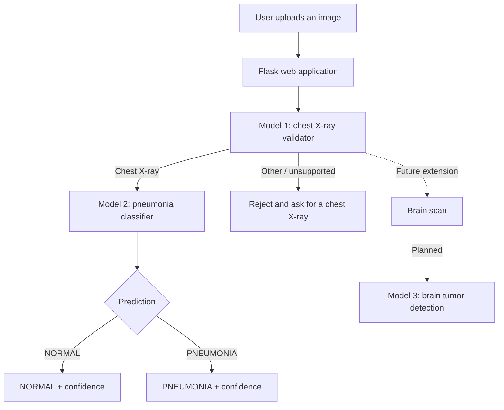
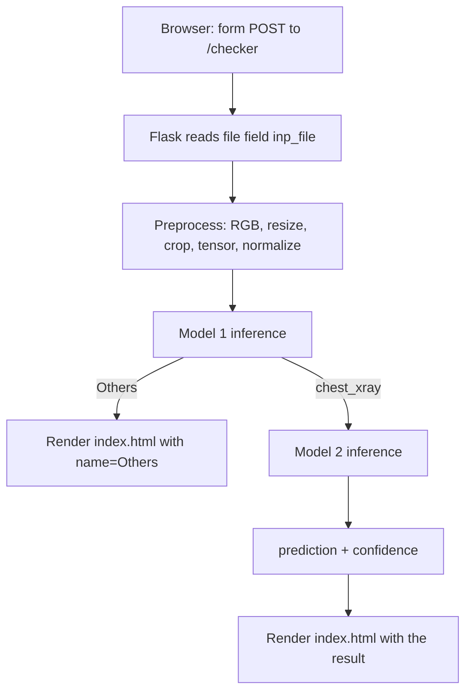
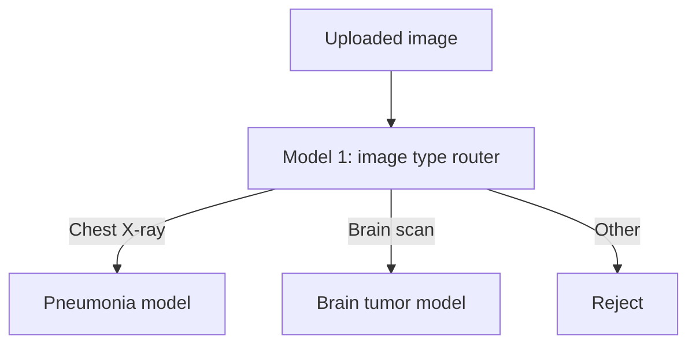

# 🫁 Lung Disease Detection using Deep Learning

**Two-Stage Medical Image Classification using PyTorch and Flask**


> **Disclaimer:** This is an educational and research project. It is **not** a medical device, it is **not** clinically validated, and it must **not** be used for real diagnosis or treatment decisions.

---

## Table of Contents

1. [Overview](#1-overview)
2. [Why Two Models](#2-why-two-models)
3. [System Architecture](#3-system-architecture)
4. [Model 1: Chest X-ray Validator](#4-model-1-chest-x-ray-validator)
5. [Model 2: Pneumonia Classifier](#5-model-2-pneumonia-classifier)
6. [Datasets](#6-datasets)
7. [CNN Architecture](#7-cnn-architecture)
8. [Image Preprocessing](#8-image-preprocessing)
9. [Training Setup](#9-training-setup)
10. [Results](#10-results)
11. [Flask Deployment](#11-flask-deployment)
12. [Request Flow](#12-request-flow)
13. [Project Structure](#13-project-structure)
14. [Installation](#14-installation)
15. [Running the Application](#15-running-the-application)
16. [Example Prediction Flow](#16-example-prediction-flow)
17. [Confidence Score](#17-confidence-score)
18. [Future Scope](#18-future-scope)
19. [Limitations](#19-limitations)
20. [Technologies Used](#20-technologies-used)
21. [Skills and Concepts Demonstrated](#21-skills-and-concepts-demonstrated)

---

## 1. Overview

This project is a deep learning based image classification system that detects **pneumonia** from **chest X-ray images**.

Instead of sending every uploaded image straight into the pneumonia classifier, the system uses a **two-stage model architecture**:

1. **Model 1** checks what kind of image was uploaded — a chest X-ray, or something else.
2. If the image is a valid chest X-ray, it is passed to **Model 2**.
3. **Model 2** classifies the X-ray as **NORMAL** or **PNEUMONIA**.
4. A **Flask** web application shows the prediction along with a confidence score.

Both models are custom CNNs written from scratch in PyTorch. They are small on purpose — about **11,486 parameters each** — so they train quickly on a laptop and run on CPU during inference.

The design is also meant to grow. A planned next step is a **brain tumor detection** model, where Model 1 becomes a general image router that sends chest X-rays to one specialist model and brain scans to another.

---

## 2. Why Two Models

A single model could technically be trained to handle every category at once. This project splits the job into two models for practical reasons:

- **Separates validation from diagnosis.** Deciding "is this even a chest X-ray?" is a different problem from "does this X-ray show pneumonia?"
- **Keeps each model specialised.** Each network only has to learn one task, which helps maintain the performance of both.
- **Stops irrelevant images from reaching the classifier.** Without a gatekeeper, a photo of a car would still get a confident "NORMAL" or "PNEUMONIA" label, because the pneumonia model has only ever seen those two classes.
- **Easier to maintain.** Either model can be retrained or replaced on its own.
- **Easier to extend.** New medical image types can be added by training a new specialist model and teaching Model 1 to route to it.

> Note: two models do not automatically mean higher accuracy. The benefit here is specialisation, input validation, and a structure that is easier to extend.

---

## 3. System Architecture



---

## 4. Model 1: Chest X-ray Validator

**File:** `src/xray_detector_model.py` (class `Net_1`) · **Weights:** `models/xray_detector.pth`

**Purpose:** decide whether an uploaded image is a chest X-ray or an unrelated image.

**Classes:** `Others`, `chest_xray`

| Split | Chest X-ray | Others | Total |
|---|---|---|---|
| Train | 4,686 | 5,281 | 9,965 |
| Test | 1,172 | 1,321 | 2,491 |
| **Total** | **5,858** | **6,602** | **12,456** |

**Test accuracy:** **99.96%** (2,490 correct out of 2,491 test images)

This model acts as a gatekeeper. Anything it labels as `Others` is rejected before it ever reaches the pneumonia classifier:

```text
Photo of a car  → Model 1 → Others     → Rejected, user is asked for a chest X-ray
Chest X-ray     → Model 1 → chest_xray → Sent on to Model 2
```

---

## 5. Model 2: Pneumonia Classifier

**File:** `src/model.py` (class `Net`) · **Weights:** `models/trained_model.pth`

**Purpose:** classify a confirmed chest X-ray as normal or pneumonia. It only runs after Model 1 has approved the image.

**Classes:** `NORMAL`, `PNEUMONIA`

| Split | NORMAL | PNEUMONIA | Total |
|---|---|---|---|
| Train | 1,266 | 3,418 | 4,684 |
| Test | 317 | 855 | 1,172 |
| **Total** | **1,583** | **4,273** | **5,856** |

**Test accuracy:** **95.65%** at the final epoch (1,121 correct out of 1,172), with a best test accuracy of **96.33%** during training. Training accuracy reached 96.48%.

Note that the dataset is imbalanced — roughly 73% of the images are pneumonia cases — so accuracy alone does not tell the full story. Precision, recall, and a confusion matrix would give a fuller picture.

---

## 6. Datasets

| Dataset | Used by | Classes | Images |
|---|---|---|---|
| `Data/` | Model 2 | NORMAL, PNEUMONIA | 5,856 |
| `model_1_dataset/` | Model 1 | chest_xray, Others | 12,456 |

Both datasets are loaded with `torchvision.datasets.ImageFolder`, which reads the class label from the folder name.

The image folders are listed in `.gitignore` and are **not included in this repository** because of their size. To retrain the models, recreate this layout locally:

```text
Data/
├── train/
│   ├── NORMAL/
│   └── PNEUMONIA/
└── test/
    ├── NORMAL/
    └── PNEUMONIA/

model_1_dataset/
├── train/
│   ├── chest_xray/
│   └── Others/
└── test/
    ├── chest_xray/
    └── Others/
```

---

## 7. CNN Architecture

Both models use the **same custom CNN**, built from scratch in PyTorch. There are no pre-trained backbones and **no fully connected layers** — the network is fully convolutional and ends with global average pooling.

**Building blocks:**

| Component | Role |
|---|---|
| `Conv2d` (3×3 and 1×1) | Learn visual features; 1×1 convolutions adjust the number of channels cheaply |
| `ReLU` | Activation function that adds non-linearity |
| `BatchNorm2d` | Batch Normalization stabilises and speeds up training by normalising intermediate activations |
| `MaxPool2d` | Halves the height and width, keeping the strongest signals |
| `AvgPool2d` (global average pooling) | Reduces each feature map to a small summary instead of flattening |
| Final `Conv2d` (16 → 2) | Acts as the classifier head and produces 2 class scores |
| `log_softmax` | Turns scores into log-probabilities, used with negative log likelihood loss |

**Layer flow:**

```text
Input 3 × 224 × 224
 → Conv(3→8)   + ReLU + BN → MaxPool
 → Conv(8→20)  + ReLU + BN → MaxPool
 → Conv(20→10) 1×1 + ReLU + BN → MaxPool
 → Conv(10→20) + ReLU + BN
 → Conv(20→32) 1×1 + ReLU + BN
 → Conv(32→10) + ReLU + BN
 → Conv(10→10) 1×1 + ReLU + BN
 → Conv(10→14) + ReLU + BN
 → Conv(14→16) + ReLU + BN
 → Global Average Pooling (4×4)
 → Conv(16→2, 4×4)  →  reshape to (batch, 2)
 → log_softmax
```

**Total parameters: 11,486** per model (about 0.04 MB of weights). Small models like this train fast and are cheap to serve.

---

## 8. Image Preprocessing

Neural networks need every image in the same shape and value range, so each image goes through the same pipeline before it reaches a model.

**At inference (`app.py`):**

```python
transforms.Compose([
    transforms.Resize(224),
    transforms.CenterCrop(224),
    transforms.ToTensor(),
    transforms.Normalize(
        [0.485, 0.456, 0.406],
        [0.229, 0.224, 0.225]
    )
])
```

Images are also converted to RGB, so 3-channel and grayscale files are both handled.

**During training,** the same steps are used plus light data augmentation, which creates small variations of each image so the model generalises better:

| Model | Extra training transforms |
|---|---|
| Model 1 | `RandomHorizontalFlip`, `RandomRotation(10)` |
| Model 2 | `ColorJitter(brightness=0.10, contrast=0.1, saturation=0.10, hue=0.1)`, `RandomHorizontalFlip`, `RandomRotation(10)` |

The test transform has no augmentation, so evaluation always runs on clean images.

---

## 9. Training Setup

| Setting | Value |
|---|---|
| Framework | PyTorch |
| Loss function | Negative log likelihood (`F.nll_loss`) with `log_softmax` outputs |
| Optimizer | SGD |
| Learning rate | 0.01 |
| Momentum | 0.8 |
| Scheduler | `StepLR` (step_size = 6, gamma = 0.5) |
| Batch size | 32 |
| Data loading | `torchvision.datasets.ImageFolder` + `DataLoader` |
| Epochs (Model 1) | 25 |
| Epochs (Model 2) | 20 |
| Hardware | Apple Silicon Mac using PyTorch **MPS** where available, with a CPU fallback |

The learning rate starts at 0.01 and is halved every 6 epochs, so the model takes big steps early and smaller, more careful steps later.

Training and evaluation code lives in the notebooks:

- `notebook/model_1.ipynb` — Model 1 (chest X-ray validator)
- `notebook/experiment.ipynb` — Model 2 (pneumonia classifier)

---

## 10. Results

| Model | Task | Dataset size | Test accuracy |
|---|---|---|---|
| Model 1 | Chest X-ray vs Other | 12,456 | **99.96%** |
| Model 2 | NORMAL vs PNEUMONIA | 5,856 | **95.65%** (best epoch: 96.33%) |

In plain English:

- **Model 1** almost always gets the image type right — it missed 1 image out of 2,491 in the test set. Telling an X-ray apart from an everyday photo is a much easier visual task than spotting a disease, so a very high score here is expected.
- **Model 2** correctly labelled about 96 out of every 100 test X-rays as normal or pneumonia.

These numbers come from held-out test folders during development. They describe performance **on this dataset only** and say nothing about clinical performance.

---

## 11. Flask Deployment

The trained models are served through a **Flask** web application (`app.py`).

What the app does:

1. Serves an upload page at `/`.
2. Receives the uploaded image at `/checker` (max upload size: 16 MB).
3. Applies the preprocessing pipeline and adds a batch dimension.
4. Runs **Model 1**. If the result is `Others`, the page asks the user to upload a chest X-ray instead.
5. If the image is a chest X-ray, runs **Model 2** on the same tensor.
6. Converts the log-probabilities with `torch.exp`, takes the highest one as the prediction, and turns it into a confidence percentage.
7. Renders the prediction and confidence back into `templates/index.html`.

**Model loading.** Weights are saved in PyTorch's `state_dict` format and loaded into the model class at startup:

```python
model = Net()
model.load_state_dict(torch.load("models/trained_model.pth", map_location="cpu"))
model.eval()
```

The `.pth` file holds only the learned weights, so the matching class definition in `src/` is always needed to rebuild the network.

---

## 12. Request Flow



The Flask view passes these values to the template, and Jinja renders them into the result card:

```html
<div class="result"
     data-prediction="{{ prediction }}"
     data-confidence="{{ confidence }}">
```

---

## 13. Project Structure

```text
Lung_Disease-_Detection/
│
├── models/
│   ├── trained_model.pth          # Model 2 weights (pneumonia classifier)
│   └── xray_detector.pth          # Model 1 weights (chest X-ray validator)
│
├── notebook/
│   ├── experiment.ipynb           # Model 2: data exploration, training, evaluation
│   └── model_1.ipynb              # Model 1: data exploration, training, evaluation
│
├── src/
│   ├── __init__.py
│   ├── model.py                   # Net       — pneumonia classifier architecture
│   └── xray_detector_model.py     # Net_1     — chest X-ray validator architecture
│
├── templates/
│   └── index.html                 # Upload page and result card
│
├── app.py                         # Flask application
├── requirements.txt               # Python dependencies
├── .gitignore
└── README.md
```

| Path | Purpose |
|---|---|
| `models/` | Trained weights in `state_dict` format |
| `notebook/` | Preprocessing, training, evaluation and experiments |
| `src/` | Reusable model definitions imported by the Flask app |
| `templates/` | Flask HTML templates |
| `app.py` | Main Flask application and inference logic |

Datasets are intentionally excluded from version control — see [Datasets](#6-datasets).

---

## 14. Installation

**1. Clone the repository**

```bash
git clone https://github.com/vineetbathla8-boop/Lung_Disease-_Detection.git
cd Lung_Disease-_Detection
```

**2. Create and activate a virtual environment**

macOS / Linux:

```bash
python -m venv .venv
source .venv/bin/activate
```

Windows:

```bash
python -m venv .venv
.venv\Scripts\activate
```

**3. Install the dependencies**

```bash
pip install -r requirements.txt
```

Core libraries used: Python, PyTorch, Torchvision, Flask, NumPy, Pillow.

**4. Check the model paths**

`app.py` currently loads the two `.pth` files using absolute paths from the original development machine. Update them to relative paths so the app runs anywhere:

```python
model.load_state_dict(torch.load("models/trained_model.pth", map_location="cpu"))
model_1.load_state_dict(torch.load("models/xray_detector.pth", map_location="cpu"))
```

---

## 15. Running the Application

```bash
python app.py
```

Flask will start a local development server, usually at:

```text
http://127.0.0.1:5000
```

Then:

1. Open the URL in a browser.
2. Upload an image (JPG or PNG, up to 16 MB).
3. Model 1 checks whether it is a chest X-ray.
4. If it is, Model 2 predicts NORMAL or PNEUMONIA.
5. The prediction and confidence score appear on the page.

This is a local development server only. There is no public deployment.

---

## 16. Example Prediction Flow

**Example 1 — chest X-ray with no pneumonia**

```text
Image → Model 1 → chest_xray → Model 2 → NORMAL → confidence score
```

**Example 2 — chest X-ray showing pneumonia**

```text
Image → Model 1 → chest_xray → Model 2 → PNEUMONIA → confidence score
```

**Example 3 — an unrelated image, such as a car**

```text
Image → Model 1 → Others → rejected → "Upload only Chest X-Ray photo"
```

---

## 17. Confidence Score

The models output log-probabilities. The app converts them with `torch.exp`, picks the highest value as the prediction, and displays that value as a percentage rounded to two decimal places.

The confidence score is simply **the model's predicted probability for the class it chose**. A high confidence means the model found the image easy to place among the classes it was trained on. It is not a measure of medical certainty, and it does not mean the model is right.

---

## 18. Future Scope

**Planned next step: brain tumor detection.**

Model 1 becomes a general image router with three possible outputs, and each supported image type gets its own specialist model:



The modular design means a new medical image category can be added by training one new model and adding one new route — the rest of the application stays as it is.

Other improvements worth adding:

- More medical image categories
- Better evaluation: precision, recall, F1 score, confusion matrix, ROC curve
- Model versioning
- Cloud deployment
- Improved UI
- Explainable AI, such as Grad-CAM heatmaps showing which region influenced the prediction
- More robust and diverse validation datasets
- A proper JSON API alongside the HTML interface
- Monitoring and logging

None of these are implemented yet.

---

## 19. Limitations

- This is an **educational and research project**, not a medical diagnosis system.
- It is **not** clinically validated and must not be used for real patient decisions.
- The reported accuracies reflect performance on these specific datasets and evaluation splits.
- The pneumonia dataset is imbalanced (about 73% pneumonia), so accuracy alone can be misleading.
- The models may not generalise to real-world clinical images from different hospitals, machines, or patient groups.
- Model 1 can only recognise image types it was trained on. An unusual medical image could still be misrouted.
- Dataset quality, size, and distribution directly affect the results.
- Validation on diverse external datasets would be required before any real-world use.

---

## 20. Technologies Used

| Area | Tools |
|---|---|
| Language | Python |
| Deep learning | PyTorch, Torchvision |
| Image handling | Pillow (PIL), NumPy |
| Web application | Flask, Jinja2 templates, HTML, CSS, JavaScript |
| Experimentation | Jupyter Notebook, Matplotlib, torchsummary, tqdm |
| Version control | Git, GitHub |

**Concepts:** Deep Learning · Convolutional Neural Networks · Computer Vision · Image Classification

---

## 21. Skills and Concepts Demonstrated

- Deep learning with custom CNN architectures
- Image classification and computer vision
- Data exploration and preprocessing
- Data augmentation
- `ImageFolder` datasets and `DataLoader` pipelines
- Batch Normalization, pooling, global average pooling
- Learning rate scheduling with `StepLR`
- Model training, evaluation, and accuracy tracking
- Saving and loading models with `state_dict`
- Serving a trained model through a Flask web application
- Multi-stage model architecture and input validation
- Git and GitHub

## Author

Built by **Vineet Bhatla** · [GitHub repository](https://github.com/vineetbathla8-boop/Lung_Disease-_Detection)

For research and educational use. Not a substitute for a radiologist's report.